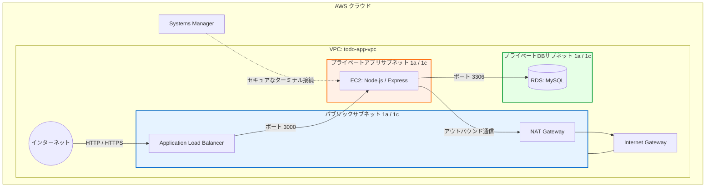

# セキュアな社内用タスク管理システム (AWS 3層アーキテクチャ・ポートフォリオ)

AWSを利用した「高可用性を意識した3層Webアーキテクチャ」の構築を目的とした、タスク管理（ToDo）アプリケーションです。

---

## デモ画像 / Demo Images


---

## 技術スタック（技術テック）

- **バックエンド:** Node.js (v18+ LTS推奨)
- **Webフレームワーク:** Express (v5)
- **テンプレートエンジン:** EJS (v5)
- **データベース:** MySQL
- **インフラストラクチャ (予定):** AWS (VPC, EC2, RDS, ALB, Route 53)

---
## AWSアーキテクチャ図

本プロジェクトにおける高可用性を意識した3層Webアーキテクチャの構成は以下の通りです。パブリックサブネットと2層のプライベートサブネットを用いて、論理的なネットワーク境界を厳格に設計しています。


### 構成図で表現・精査したポイント
1. **3層アーキテクチャの視覚化:** パブリック、プライベートアプリ、プライベートDBの3つのサブネット層を明示し、セキュリティグループの最小権限の原則（ALBからEC2、EC2からRDSへのアクセス）を矢印の向きとポート番号で表現しました。
2. **SSMによるセキュアな接続:** EC2にSSHキーペアを持たせず、Systems Manager（SSM）経由で接続している経路を点線で可視化しています。
3. **NAT Gatewayの経路:** プライベートサブネットから外部パッケージを取得するためのアウトバウンド通信経路（NAT GatewayからIGWへ抜ける経路）を正確に反映しています。
---

## ディレクトリ構成

```text
.
├── .gitignore          # Git管理対象外ファイルの指定
├── package.json        # 依存パッケージ一覧
├── package-lock.json   # 依存パッケージのバージョン固定
├── server.js           # アプリケーションのエントリーポイント（ルーティング・DB接続）
└── views/
    └── index.ejs       # タスク一覧・追加用の画面テンプレート
```

## 技術の導入理由（技術選定の背景）

- **Node.js (Express)**:
  - ノンブロッキングI/Oによる非同期処理が得意であり、軽量で高速なレスポンスが可能なため採用しました。
  - モダンなWeb開発のデファクトスタンダードであり、インフラ側の学習と並行して効率的に開発を進めるために最適なフレームワークだと判断しました。

- **SSR (サーバーサイドレンダリング / EJS)**:
  - 今回はインフラ（AWSネットワーク設計や可用性の担保）の学習・構築に重きを置いているため、フロントエンド（SPA等）の複雑性を排除し、インフラ基盤の堅牢さを証明しやすいSSRアーキテクチャを採用しています。

- **MySQL**:
  - 将来的なAWSデプロイにおいて、Amazon RDSのマルチAZ配置やセキュリティグループの設計を学ぶため、実務で最も採用例の多いリレーショナルデータベースを選択しました。

---

## コードの優秀な部分（実務を意識した設計・工夫点）

インフラ構築を見据え、アプリケーション側のコードにも以下のプロフェッショナルなアプローチを取り入れています。

### セキュアな環境変数管理 (dotenv / .gitignore の徹底)

データベースの接続情報やパスワードなどの機密情報はコード内に一切ハードコーディングせず、環境変数として分離しています。GitHub上に認証情報が漏洩しないセキュアな管理を徹底しています。

### データベースへの負荷を軽減する「コネクションプール」

将来的にアクセスが増大しEC2がスケールアウトした際、RDSへの接続過多でシステムがダウンしないよう、リクエストごとの接続・切断を避けるコネクションプール（Connection Pool）を利用してリソースを最適化しています。

### 完全なSQLインジェクション対策（プレースホルダーの利用）

フォームから入力された値は直接SQLに結合せず、すべてプレースホルダー（?）を用いてバインドすることで、悪意のあるクエリ実行を完全に防ぐ設計にしています。

### PRGパターンの実装による二重送信防止

タスクの追加・更新・削除処理（POST）の直後にリダイレクト（GET）を行うPRG（Post/Redirect/Get）パターンを実装し、ユーザーのブラウザリロードによるデータの意図しない二重登録を防いでいます。

---

## ローカル環境の構築手順（Getting Started）

本アプリケーションをローカル環境で実行するための手順です。

### 1. 前提条件

Node.js (v18以上)

MySQL (v8.0以上) がインストールされ、起動していること。

### 2. データベースのセットアップ

MySQLにログインし、以下のSQLを実行してデータベースとテーブルを作成してください。

```SQL
CREATE DATABASE todo_db;
USE todo_db;

CREATE TABLE tasks (
    id INT AUTO_INCREMENT PRIMARY KEY,
    title VARCHAR(255) NOT NULL,
    status ENUM('pending', 'completed') DEFAULT 'pending',
    created_at TIMESTAMP DEFAULT CURRENT_TIMESTAMP,
    updated_at TIMESTAMP DEFAULT CURRENT_TIMESTAMP ON UPDATE CURRENT_TIMESTAMP
);
```

### 3. インストールと環境設定

リポジトリをクローン後、依存パッケージをインストールします。

```bash
npm install
```

プロジェクトのルートディレクトリに .env ファイルを作成し、ご自身のデータベース接続情報に合わせて以下の内容を記述してください。

```コードスニペット
DB_HOST=localhost
DB_USER=root
DB_PASSWORD=your_mysql_password
DB_NAME=todo_db
PORT=3000
```

### 4. アプリケーションの起動

```bash
node server.js
```

起動後、ブラウザで http://localhost:3000 にアクセスしてください。

---

## これからの作業（AWSへのデプロイ計画）

現在はローカル環境（Step 1）での実装が完了しており、今後は以下のステップでAWS上への本番環境デプロイを進めます。

- [x] Step 1: ローカル環境でのセキュアなCRUDアプリケーション開発

- [x] Step 2: AWSネットワーク基盤の構築 (VPC)

パブリックサブネットとプライベートサブネットを分離し、論理的なネットワーク境界を設計する。

※ 構築手順の詳細は [docs/aws-step2-vpc-setup.md](docs/aws-step2-vpc-setup.md) を参照。

- [x] Step 3: データベースのセキュアな配置 (Amazon RDS)

プライベートサブネットにMySQLを構築し、EC2からの通信のみを許可する最小権限のセキュリティグループを設定する。

※ 構築手順の詳細は [docs/aws-step3-rds-setup.md](docs/aws-step3-rds-setup.md) を参照。

- [x] Step 4: Webサーバーの構築とアプリのデプロイ (Amazon EC2)

プライベートサブネットにEC2を立ち上げ、SSM経由でセキュアに接続。Node.js 22環境を構築し、PM2を用いてアプリケーションを永続化しました。

※ 構築手順の詳細は [docs/aws-step4-ec2-setup.md](docs/aws-step4-ec2-setup.md) を参照。

- [x] Step 5: 可用性とセキュリティの向上 (ALB / Route 53)

パブリックサブネットにロードバランサー（ALB）を配置し、インターネットからプライベートサブネット内のEC2（Node.js）へのセキュアなトラフィック転送経路を構築しました。

※ 運用コストの観点から独自ドメインの取得およびRoute 53/ACMを用いたHTTPS化は見送りましたが、ALBのDNS名を用いたHTTP通信による3層アーキテクチャの疎通テスト（パブリックからプライベートDBまでの経路確認）とトラブルシューティングを完了しています。本番運用へ移行する際は、ALBにHTTPSリスナーを追加し、ポート80から443へのリダイレクトを強制する設計を想定しています。

構築手順の詳細は [docs/aws-step5-alb-setup.md](docs/aws-step5-alb-setup.md) を参照。

- [x] Step 6: 環境のクリーンアップ手順の確立

検証完了後、予期せぬ継続課金が発生しないよう、リソース間の依存関係を考慮した完全な削除手順をドキュメント化し、消し残りを厳しく精査するフローを確立しました。

※ クリーンアップ手順の詳細は [docs/aws-step6-cleanup.md](docs/aws-step6-cleanup.md) を参照。
